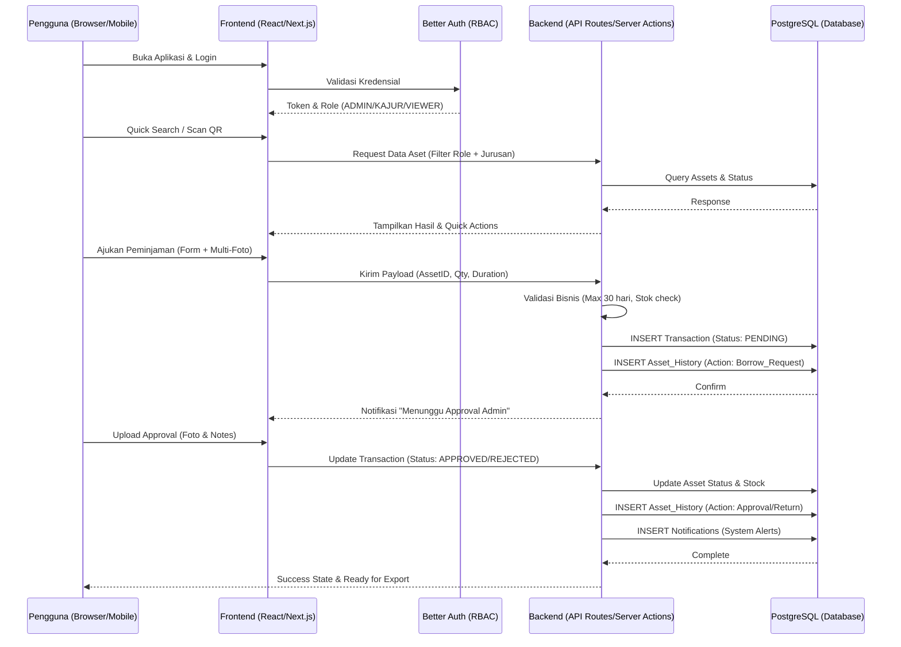
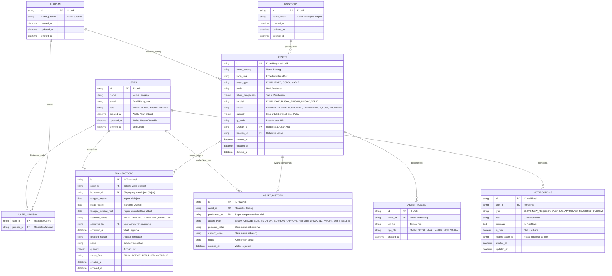

# PRD — Project Requirements Document

## 1. Overview
Sekolah seringkali menghadapi kesulitan dalam mendata, melacak, dan mengelola perpindahan barang. Permasalahan utama yang ada saat ini adalah rumitnya proses pencatatan aset (seperti meja, kursi, komputer) hingga barang proyek/habis pakai (seperti alat kebersihan, pasir, batu, dll), serta tidak terstrukturnya proses pinjam-meminjam barang antar jurusan.

Aplikasi **Sistem Manajemen Aset Sekolah** ini hadir sebagai solusi terpusat agar seluruh siklus hidup barang di sekolah dapat dikelola dengan mudah, terstruktur, transparan, dan siap produksi. Tujuan utama aplikasi ini adalah memberikan kemudahan bagi staf sekolah untuk mengecek ketersediaan barang ("*First Win*"), memproses peminjaman/pengembalian dengan bukti visual, approval yang ketat, serta melihat riwayat pergerakan suatu aset secara akurat dan otomatis.

## 2. Requirements
- **Berbasis Web & Responsif:** Aplikasi harus dapat diakses melalui laptop maupun *smartphone* agar memudahkan pencatatan dan audit lapangan.
- **Role-Based Access Control (RBAC) Konsisten:** Sistem harus dengan ketat memisahkan hak akses menggunakan *naming* standar:
  - **ADMIN (Sekretaris/Sarpras):** Kontrol penuh untuk pendataan barang, approval, pengelolaan pengguna, mutasi, dan konfigurasi sistem.
  - **KAJUR (Ketua Jurusan):** Melihat daftar barang di jurusan yang ditugaskan, mengajukan peminjaman. Satu akun dapat mengelola lebih dari satu jurusan sekaligus (Multi-Jurusan).
  - **VIEWER (Kepala Sekolah, Bendahara):** Hanya bisa melihat data, *dashboard*, dan laporan (Read-Only).
  - **Pembuatan Akun:** Tidak ada fitur registrasi mandiri. Seluruh akun pengguna baru **hanya dapat dibuat oleh Admin** melalui panel terpusat.
- **Dukungan Multi-Tipe Barang:** Logika terpisah untuk "Aset Tetap" (`FIXED`) dan "Barang Habis Pakai" (`CONSUMABLE`) dengan tracking stok dan perilaku peminjaman yang berbeda.
- **Standar Production-Ready:** Menggunakan database relasional kuat, dukungan *soft-delete*, *timestamp* lengkap, validasi ketat, dan audit trail otomatis.
- **Modernisasi & Skalabilitas:** Integrasi QR Code untuk identifikasi aset, Import Excel untuk migrasi data awal, serta arsitektur yang mendukung pertumbuhan data sekolah.
- **Audit Cepat:** Sistem harus menyediakan riwayat perpindahan dan kondisi barang secara rapi, otomatis, dan mudah dibaca untuk keperluan audit internal.

## 3. Core Features
1.  **Manajemen Data Barang (FIXED vs CONSUMABLE)**
    - Form pencatatan detail: nama, merk, kode plat, tahun, lokasi, jurusan.
    - `FIXED`: Dilacak via peminjaman/pengembalian. Status bisa `AVAILABLE`, `BORROWED`, `MAINTENANCE`, `LOST`.
    - `CONSUMABLE`: Dilacak via stok yang berkurang permanen (quantity-based). Tidak ada proses pengembalian fisik.
2.  **Manajemen Pengguna & Multi-Jurusan**
    - Admin membuat/edit/nonaktifkan akun Kajur/Viewer tanpa registrasi publik.
    - Penugasan multi-jurusan per akun Kajur (relasi Many-to-Many). Kajur dapat berpindah tab/filter jurusan secara instan.
3.  **Sistem Peminjaman, Approval & Pengembalian**
    - Kajur ajukan peminjaman (maks 30 hari), pilih jurusan jika memegang >1.
    - Workflow Approval lengkap: `PENDING` → `APPROVED`/`REJECTED`. Metadata: `approved_by`, `approved_at`, `rejected_reason`, `notes`, `quantity`.
    - Upload multi-foto bukti kondisi awal & akhir secara visual.
4.  **Pelacakan Lokasi & QR Code**
    - Mutasi lokasi aset resmi (misal: Lab Komputer → Kelas X-A).
    - Generate QR Code otomatis per aset. Scan via mobile langsung buka detail/status barang & riwayat terakhir.
5.  **Audit Trail & History Otomatis**
    - Setiap aksi (Create, Edit, Mutation, Borrow, Approve, Return, Damage, Import) otomatis masuk `ASSET_HISTORY`.
    - Mencatat `performed_by`, `action_type`, `timestamp`, dan detail perubahan.
6.  **Dashboard & Quick Availability Search ("First Win")**
    - Search bar *prominent* di dashboard: cek ketersediaan real-time (misal: "Proyektor tersedia?").
    - Angka visual: total aset, tersedia, dipinjam, stok consumable, aset rusak.
7.  **Notification Center**
    - Sistem notifikasi in-app: Pengajuan baru, Reminder jatuh tempo (>30 hari status overdue), Barang rusak/retur, dan Notifikasi approval.
8.  **Pelaporan & Ekspor Data**
    - Filter laporan per jurusan, lokasi, status, kondisi.
    - Ekspor laporan ke PDF & Excel untuk kebutuhan administrasi sekolah.
9.  **Bulk Migration (Import Excel)**
    - Upload spreadsheet inventaris lama. Auto-mapping kolom, validasi data, dan batch insert dengan pencatatan history "Import Data".

## 4. User Flow
**Skenario Utama: Migrasi Data, Pembuatan Akun, & Siklus Pinjam-Kembali**
1.  **Admin** login, buka menu "Import Excel", upload data inventaris lama. Sistem memvalidasi, batch insert, dan otomatis mencatat history `IMPORT`.
2.  **Admin** masuk ke "Manajemen Pengguna", buat akun `KAJUR`, isi email/nama, centang jurusan yang akan dipegang (bisa 2+ jurusan). Akun aktif langsung.
3.  **Kajur** login. Dashboard menampilkan tab/dropdown filter jurusan yang dipegang.
4.  **Kajur** menggunakan "Quick Search" di dashboard atau scan QR di lapangan untuk verifikasi identitas & cek status barang secara instan.
5.  **Kajur** pilih barang, isi kebutuhan (`quantity`), durasi (sistem validasi maks 30 hari), lalu "Ajukan Peminjaman". Status transaksi: `PENDING`. Notifikasi dikirim ke Admin.
6.  **Admin** review permintaan. Klik "Setujui" (auto-generate `approved_by`, `approved_at`, upload foto awal) atau "Tolak" (isi `rejected_reason`).
7.  Status aset berubah. History & Notifikasi tercatat otomatis.
8.  **Kajur** mengembalikan barang. **Admin** proses pengembalian, upload foto akhir, catat kerusakan/note, set status kembali `AVAILABLE`.
9.  Jika melewati 30 hari tanpa pengembalian, sistem trigger notifikasi Overdue & catat di history.

## 5. Architecture
Aplikasi menggunakan arsitektur *Client-Server* modern (Next.js App Router) dengan fokus pada integritas data, keamanan RBAC, dan skalabilitas.

## 6. Database Schema
Skema dirancang untuk production, mendukung relasi kompleks, audit trail, soft-delete, dan fleksibilitas tipe barang.

## 7. Tech Stack
Rekomendasi teknologi modern, teruji, dan dioptimalkan untuk standar production multi-user:

-   **Frontend & Backend:** `Next.js 14+` (App Router, Server Actions/Route Handlers untuk performa tinggi)
-   **Styling & UI Components:** `Tailwind CSS` & `shadcn/ui` (Komponen siap pakai, konsisten, accessible, mobile-friendly)
-   **Database:** `PostgreSQL` (Database relasional kuat, JSONB support, concurrency tinggi, ideal untuk production sekolah)
-   **ORM:** `Drizzle ORM` (Type-safe, ringan, performa tinggi, migrasi database terkelola)
-   **Authentication & RBAC:** `Better Auth` atau `NextAuth.js` (Sesi aman, middleware proteksi rute, enforcement role `ADMIN/KAJUR/VIEWER`)
-   **Form & Validation:** `React Hook Form` + `Zod` (Validasi frontend & backend sesuai business rules)
-   **File Storage & Multi-Image:** `UploadThing` atau `AWS S3` (CDN cepat, signed URLs, upload multi-file dengan preview)
-   **Export & Reporting:** `jspdf` + `xlsx` (Library client-side untuk export, atau server-side via `puppeteer`/`playwright` jika perlu rendering kompleks)
-   **Deployment:** `Vercel` (Edge network, CI/CD otomatis, terintegrasi sempurna dengan Next.js & PostgreSQL addons)

## 8. Business Rules & Validasi
1.  **RBAC Strict:** Middleware memastikan rute & aksi hanya sesuai enum role `ADMIN`, `KAJUR`, atau `VIEWER`. Tidak ada bypass hak akses.
2.  **Batas Peminjaman:** Sistem menolak input durasi > `30 hari`. Otomatis hitung `batas_waktu` saat pengajuan.
3.  **Ketersediaan:** Barang dengan `status != AVAILABLE` tidak bisa diajukan untuk dipinjam.
4.  **Stok Consumable:** `quantity` terutang harus `<=` stok tersedia. Stok tidak boleh minus atau nol negatif.
5.  **Approval Gate:** Transaksi `PENDING` tidak mengubah status aset jadi `BORROWED` sampai `APPROVED` secara eksplisit oleh `ADMIN`.
6.  **Soft Delete:** Data tidak dihapus permanen (`DELETE`). Gunakan kolom `deleted_at`. Filter otomatis menyembunyikan data terarsip di UI, tapi tetap bisa diakses admin untuk audit legal.
7.  **Multi-Jurusan Isolation:** Kajur hanya bisa melihat/mengajukan aset di jurusan yang tercantum di tabel `USER_JURUSAN`.
8.  **Audit Wajib:** Setiap mutasi data wajib mencatat `performed_by`, `action_type`, `timestamp` di `ASSET_HISTORY`.

## 9. UI/UX Guidelines
-   **Konsistensi & Kesederhanaan:** Navigasi minimalis, workflow pendek. Fokus pada *mobile-first* mengingat aktivitas lapangan.
-   **Feedback System:** Loading skeleton, success/error toast notification yang jelas.
-   **Empty & Error States:** Pesan konteks jika tidak ada data ("Belum ada aset di jurusan ini"), atau koneksi gagal ("Periksa jaringan, lalu muat ulang"). Tidak boleh tampil tabel kosong tanpa keterangan.
-   **Pagination & Performance:** Daftar aset menggunakan pagination (10-20 item/halaman) untuk menjaga performa rendering dan mengurangi beban database.
-   **Multi-Foto Upload:** Antarmuka drag-and-drop dengan preview thumbnail, validasi format & ukuran, dan indikator progress upload.
-   **Quick Access:** "Quick Availability Search" selalu visible di dashboard utama sebagai *hero element* untuk mendukung "First Win".

## 10. Roadmap Pengerjaan
-   **Phase 1 (Core & MVP):** Auth & RBAC, CRUD Aset & Jurusan, Lokasi, Sistem Peminjaman & Approval, Dashboard Dasar, Notifikasi In-App, Validasi Bisnis Dasar. *(Target: Siap uji coba internal)*
-   **Phase 2 (Audit & Reporting):** Audit Trail Otomatis, History Log, Multi-Upload Foto, Export PDF/Excel, Notification Center Lengkap, Soft Delete, Pagination & Filtering Lanjut. *(Target: Stabil & Siap Produksi)*
-   **Phase 3 (Advanced & Optimization):**, Import Excel (Bulk Upload), Maintenance Management, Advanced Analytics, Optimasi Performance & Security Hardening. *(Target: Scaling & Modernisasi)*